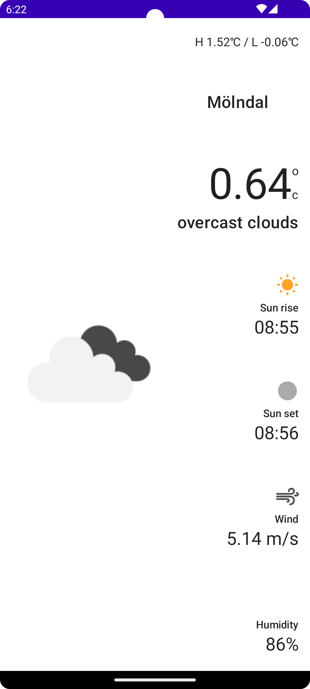
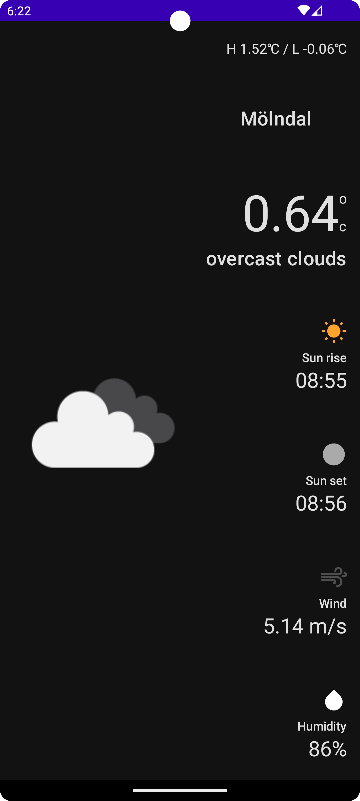

# Android - Weather ❤️ Compose

## Architecture

<p align="center">

</p>

## :camera: Screenshots

| Light mode | Dark mode |
| :---: | :---: |
|  |  |

## :blue_book: Feature

- Show the current weather by location latitude and longitude.

## API

- [OpenWeatherMap](https://openweathermap.org/)

## :hammer: How to build app

- Using the newest version of Android Studio.
- You must add `BASE_URL`, `API_KEY` and `IMAGE_URL` inside `local.properties` to build and run the app, like the code below:

    ```kotlin
    API_KEY=API_KEY // Fill your open weather api key in here
    BASE_URL="https://api.openweathermap.org/data/2.5/"
    IMAGE_URL="https://openweathermap.org/img/wn/{icon}@4x.png"
    ```


## :mag_right: Unit test

- Using [Mockito](https://site.mockito.org/) to write mock unit test.
- Using [Espresso](https://developer.android.com/training/testing/espresso) to write concise, beautiful, and reliable Android UI tests.
- Using [Compose_UI](https://developer.android.com/jetpack/compose/testing) to write Jetpack compose UI tests.
- Using [JUnit4](https://github.com/junit-team/junit4) to write unit test.
